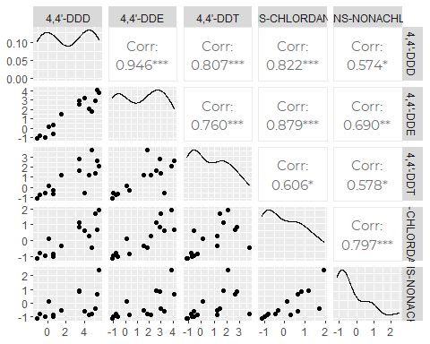
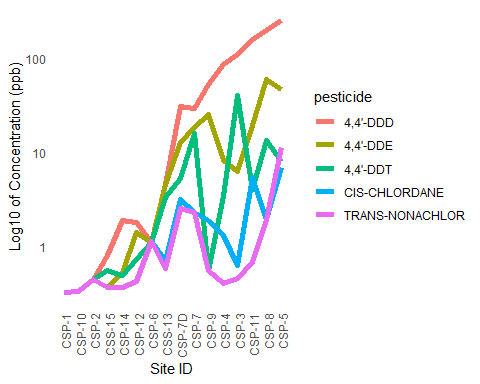
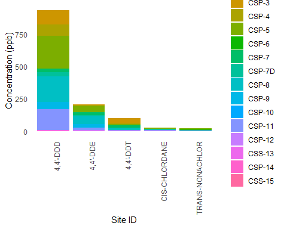
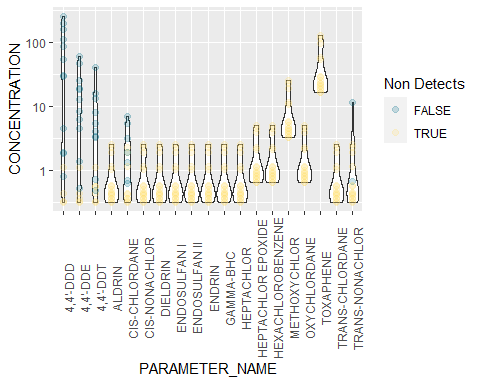
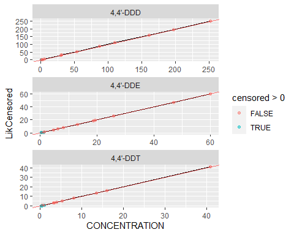
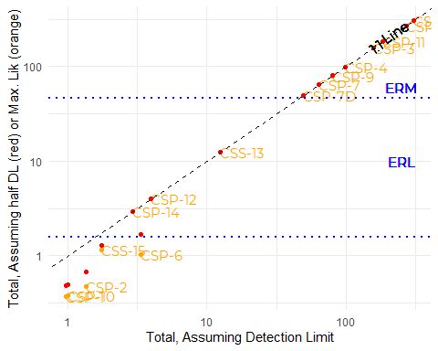

Analysis of Sediment Toxicity Data : Pesticides
================
Curtis C. Bohlen, Casco Bay Estuary Partnership
7/16/2020

-   [Install Libraries](#install-libraries)
-   [Load Basic Data](#load-basic-data)
-   [Chemical Parameters](#chemical-parameters)
-   [Extract Pesticides Data](#extract-pesticides-data)
-   [Frequency of Detects by
    Parameter](#frequency-of-detects-by-parameter)
-   [Inital Pairs Plot](#inital-pairs-plot)
-   [A Graphic Check for
    Reasonableness](#a-graphic-check-for-reasonableness)
-   [Initial graphics](#initial-graphics)
-   [Screening Levels](#screening-levels)
-   [Handling Non-detects](#handling-non-detects)
    -   [Distributional graphics](#distributional-graphics)
-   [Alternate Estimates of Sum of DDT
    Residues](#alternate-estimates-of-sum-of-ddt-residues)
    -   [Applying to the DDT Residues
        data](#applying-to-the-ddt-residues-data)
-   [Final Graphic](#final-graphic)
-   [Conclusion](#conclusion)
-   [Correcting for Half non-detects](#correcting-for-half-non-detects)
    -   [Raw Observations](#raw-observations)
    -   [So, correct values](#so-correct-values)
        -   [Calculate half DL limits both
            ways](#calculate-half-dl-limits-both-ways)
        -   [Calculate Maximum Likelihood Estimator two
            ways](#calculate-maximum-likelihood-estimator-two-ways)


# Install Libraries

``` r
library(readxl)
library(tidyverse)
```

    ## -- Attaching packages --------------------------------------- tidyverse 1.3.1 --

    ## v ggplot2 3.3.5     v purrr   0.3.4
    ## v tibble  3.1.6     v dplyr   1.0.7
    ## v tidyr   1.1.4     v stringr 1.4.0
    ## v readr   2.1.1     v forcats 0.5.1

    ## -- Conflicts ------------------------------------------ tidyverse_conflicts() --
    ## x dplyr::filter() masks stats::filter()
    ## x dplyr::lag()    masks stats::lag()

``` r
library(GGally)
```

    ## Registered S3 method overwritten by 'GGally':
    ##   method from   
    ##   +.gg   ggplot2

``` r
library(maxLik)
```

    ## Loading required package: miscTools

    ## 
    ## Please cite the 'maxLik' package as:
    ## Henningsen, Arne and Toomet, Ott (2011). maxLik: A package for maximum likelihood estimation in R. Computational Statistics 26(3), 443-458. DOI 10.1007/s00180-010-0217-1.
    ## 
    ## If you have questions, suggestions, or comments regarding the 'maxLik' package, please use a forum or 'tracker' at maxLik's R-Forge site:
    ## https://r-forge.r-project.org/projects/maxlik/

``` r
library(CBEPgraphics)
load_cbep_fonts()

library(LCensMeans)
```

# Load Basic Data

``` r
sibfldnm <- 'Data'
parent <- dirname(getwd())
sibling <- paste(parent,sibfldnm, sep = '/')
fn <- 'working_data.xls'

the.data <- read_excel(paste(sibling,fn, sep='/'), 
    sheet = "Combined", col_types = c("skip", 
        "text", "skip", "skip", "skip", 
        "skip", "skip", "skip", "skip", 
        "text", "text", "numeric", "text", 
        "numeric", "text", "numeric", "numeric", 
        "text", "text", "text", "skip", 
        "skip", "skip", "skip", "skip", 
        "numeric", "numeric", "skip", "skip", 
        "skip", "skip", "skip", "skip", 
        "skip")) %>%
  mutate(SAMPLE_ID = factor(SAMPLE_ID, levels = c("CSP-1", "CSP-2", "CSP-3", 
                                                  "CSP-4", "CSP-5", "CSP-6",
                                                  "CSP-7", "CSP-7D", "CSP-8", 
                                                  "CSP-9", "CSP-10", "CSP-11",
                                                  "CSP-12", "CSS-13", "CSP-14",
                                                  "CSS-15")))
```

# Chemical Parameters

Pesticide Anylates are listed in a separate tab in the original Excel
spreadsheet. Here we pull them into a vector, for later use.

``` r
tmp<- read_excel(paste(sibling,fn, sep='/'), sheet = "Pesticides", skip = 3)
```

    ## New names:
    ## * Result -> Result...3
    ## * Qual -> Qual...4
    ## * Result -> Result...5
    ## * Qual -> Qual...6
    ## * Result -> Result...7
    ## * ...

``` r
Pesticides.names <- tmp %>%
  select(1) %>%
  slice(1:19) %>%
 pull(PARAMETER_NAME)
Pesticides.names
```

    ##  [1] "4,4'-DDD"           "4,4'-DDE"           "4,4'-DDT"          
    ##  [4] "ALDRIN"             "CIS-CHLORDANE"      "CIS-NONACHLOR"     
    ##  [7] "DIELDRIN"           "ENDOSULFAN I"       "ENDOSULFAN II"     
    ## [10] "ENDRIN"             "GAMMA-BHC"          "HEPTACHLOR"        
    ## [13] "HEPTACHLOR EPOXIDE" "HEXACHLOROBENZENE"  "METHOXYCHLOR"      
    ## [16] "OXYCHLORDANE"       "TOXAPHENE"          "TRANS-CHLORDANE"   
    ## [19] "TRANS-NONACHLOR"

``` r
rm(tmp)
```

# Extract Pesticides Data

We filter down to selected parameters defined by that list of
parameters. The second and third filters remove QA/QC samples. We have
some duplicate samples: 1. For CSP-6, CSP-15 - all measurements 2. For
CSP-10 - TOC data only 3. CSP-9 - all observations EXCEPT TOC. To deal
with duplicate samples, we calculate means.

The following code reads in data and assigns the value of the reporting
limit to data that was below the detection limits. This sets us up for
later analysis based on different assumptions about how to handle the
non-detects.

``` r
Pesticides.data.long <- the.data %>%
  filter (the.data$PARAMETER_NAME %in% Pesticides.names) %>%
  filter(is.na(`%_RECOVERY`)) %>%
  filter(SAMPLE_ID != 'QC') %>%
  mutate(CONCENTRATION = ifelse(is.na(CONCENTRATION) & LAB_QUALIFIER == 'U', 
                                REPORTING_LIMIT, CONCENTRATION)) %>%
  group_by(SAMPLE_ID, PARAMETER_NAME) %>%
  summarize(CONCENTRATION = mean(CONCENTRATION, na.rm=TRUE),
            censored = sum(LAB_QUALIFIER=='U', na.rm=TRUE),
            .groups = 'drop') %>%
  ungroup()
```

# Frequency of Detects by Parameter

``` r
Pesticides.data.long %>%
  group_by(PARAMETER_NAME) %>%
  summarize(n = n(),
            detects = sum(censored==0),
            nondetects = sum(censored>0))
```

    ## # A tibble: 19 x 4
    ##    PARAMETER_NAME         n detects nondetects
    ##    <chr>              <int>   <int>      <int>
    ##  1 4,4'-DDD              16      12          4
    ##  2 4,4'-DDE              16      11          5
    ##  3 4,4'-DDT              16      10          6
    ##  4 ALDRIN                16       0         16
    ##  5 CIS-CHLORDANE         16       7          9
    ##  6 CIS-NONACHLOR         16       0         16
    ##  7 DIELDRIN              16       0         16
    ##  8 ENDOSULFAN I          16       0         16
    ##  9 ENDOSULFAN II         16       0         16
    ## 10 ENDRIN                16       0         16
    ## 11 GAMMA-BHC             16       0         16
    ## 12 HEPTACHLOR            16       0         16
    ## 13 HEPTACHLOR EPOXIDE    16       0         16
    ## 14 HEXACHLOROBENZENE     16       0         16
    ## 15 METHOXYCHLOR          16       0         16
    ## 16 OXYCHLORDANE          16       0         16
    ## 17 TOXAPHENE             16       0         16
    ## 18 TRANS-CHLORDANE       16       0         16
    ## 19 TRANS-NONACHLOR       16       2         14

So, most pesticides were never detected. The exceptions include:
`4,4'-DDD`, `4,4'-DDE`, `4,4'-DDT`, `CIS-CHLORDANE`, `TRANS-NONACHLOR`
But even several of those were only detected once, which suggests the
analytic chemistry was not well suited to dirty harbor sediments.

``` r
Pesticides.data <- Pesticides.data.long %>%
  select(-censored) %>%
  filter(PARAMETER_NAME %in% c("4,4'-DDD", "4,4'-DDE", "4,4'-DDT",
                               "CIS-CHLORDANE", "TRANS-NONACHLOR")) %>%
  spread(key = PARAMETER_NAME, value = CONCENTRATION) %>%
  rowwise() %>%
  mutate(totPesticides = sum(c(`4,4'-DDD`, `4,4'-DDE`, `4,4'-DDT`,
                               `CIS-CHLORDANE`, `TRANS-NONACHLOR`), na.rm = TRUE))
```

# Inital Pairs Plot

``` r
ggpairs(log(Pesticides.data[2:6]), progress=FALSE)
```

<!-- -->

Highly skewed data, even after log transformation. Some moderate
correlations evident.

# A Graphic Check for Reasonableness

``` r
tmp <- Pesticides.data.long %>%
  group_by(SAMPLE_ID) %>%
  summarize(totPesticides = sum(CONCENTRATION, na.rm = TRUE),
            countPesticides = sum(censored==0, na.rm=TRUE))

plt <- ggplot(tmp, aes(totPesticides, countPesticides)) +
  geom_point() +
  geom_text(aes(label = SAMPLE_ID),nudge_y = .2, nudge_x = .075) +
  geom_smooth() +
  scale_x_log10() +
  xlab('Log Total Pesticides (ppb)') +
  ylab('Number of Pesticides observed') +
  theme_minimal() +
  theme(axis.text.x = element_text(angle = 90, hjust = 1)) +
  theme(panel.grid = element_blank()) 
plt
```

    ## `geom_smooth()` using method = 'loess' and formula 'y ~ x'

<!-- -->

So, unlike for the PCBs, the inordinately high detection limits for
CSP-8 do not appear as a wild outlier. Presumably, this is because the
detection limits are an order of magnitude lower here than for the PCBs.
However, it is notable that the site still has the highest sum of
pesticides (based here on assuming the “real” concentration is the
detection limit). For consistency, we could consider removing CSP-8 from
the data, but for now we don’t do so.

# Initial graphics

``` r
tmp <- Pesticides.data
tmp$SAMPLE_ID <- reorder(tmp$SAMPLE_ID, tmp$totPesticides, mean, na.rm = TRUE)

tmp <- tmp %>% gather(key = 'pesticide', value = 'Concentration', 2:6) %>%
  mutate(pesticide = factor(pesticide)) %>%
  mutate(pesticide = reorder(pesticide, Concentration, function(x) -x[1]))
 
  
plt <- ggplot(tmp, aes(x=as.numeric(SAMPLE_ID), y = Concentration, 
                       color = pesticide)) +
  geom_line(lwd = 2) +
  scale_x_continuous(breaks = c(1:16-0.25), labels = levels(tmp$SAMPLE_ID), 
                     minor_breaks = FALSE) +
  #scale_color_discrete(labels = substr(levels(tmp$Pesticides), 0, 
      #gregexpr(pattern ='.,',levels(tmp$Pesticides) ) )) +
  xlab('Site ID') +
  ylab('Log10 of Concentration (ppb)') +
  scale_y_log10() +
  theme_minimal() +
  theme(axis.text.x = element_text(angle = 90, hjust = 1)) +
  theme(panel.grid = element_blank()) 
plt
```

<!-- -->

\#\#Sites by Pesticides

``` r
tmp <- Pesticides.data

tmp <- tmp %>% gather(key = 'pesticide', value = 'Concentration', 2:6) %>%
  mutate(pesticide = factor(pesticide)) %>%
  mutate(pesticide = reorder(pesticide, Concentration, function(x) -x[1]))

plt <- ggplot(tmp, aes(pesticide, Concentration)) +
  geom_col(aes(fill = SAMPLE_ID)) +
  xlab('Site ID') +
  ylab('Concentration (ppb)') +
  theme_minimal() +
  theme(axis.text.x = element_text(angle = 90, hjust = 1)) +
  theme(panel.grid = element_blank()) 
plt
```

<!-- -->

So, real Pesticide data is dominated by the DDT residues. Other
compounds appear high at CSP5 and CSP8, but only because of high levels
of non-detects. We only need to look at DDT residues. NOAA’s SQUIRTS
include screening levels for the sum of the three main DDT residues.

# Screening Levels

The SQUIRTS for the sum of the three DDT residues are as follows;

``` r
type   <- c('TEL', 'ERL', 'PEL', 'ERM', 'AET')
levels <- c(3.89, 1.58,51.7, 46.1, 11)
```

Note that the SQUIRTS have screening levels for “Chlordane” but not
“cis-Chlordane”, and no screening values for Nonachlor.

# Handling Non-detects

The preceding plots were based on modeling the value of non-detects as
equal to the Reporting Limit, which is a very conservative approach.
Since detection limits for all organic contaminants are correlated as
reported by the laboratory, this is problematic, especially for CSP-8,
which had unusually high detection limits.

A better approach uses the available data to estimate values of censored
data based on available data – including knowledge of detection limits
and whether pesticides were detected.

## Distributional graphics

What kind of distribution do we actually have?

``` r
plt <- ggplot(Pesticides.data.long, aes(PARAMETER_NAME, CONCENTRATION)) +
  geom_violin() +
  geom_point(aes(color = censored>0), alpha = 0.2, size=2) +
  scale_color_manual(name = 'Non Detects', values = cbep_colors()) +
  scale_y_log10() +
  theme(axis.text.x = element_text(angle=90))
plt
```

<!-- -->

So, if we focus on the DDT residues, we actually have pretty good data,
with only limited non-detects, and pretty close to a long-normal
distribution (as far as we can tell with these very limited data).

# Alternate Estimates of Sum of DDT Residues

We want to focus on analysis of the sum of DDT residues, in part because
the residues are highly correlated. The question is, how do we best
handle non-detects? Often in environmental analyses, non-detects are
replaced by zero, by the detection limit, or by half the detection
limit, but none of those conventions rests on strong statistical
principals. We instead implement a method that estimates the
(unobserved) value of non-detects using a conditional mean of censored
observations derived from a maximum likelihood procedure.

The idea is to fit a maximum likelihood model to the data assuming a
censored lognormal distribution. With a lognormal density in hand, we
can estimate a conditional mean of for “unobserved” observations below a
the detection limit by sampling from the underlying lognormal
distribution 1000 times (or more) and calculating a mean.

We developed functions for implementing this procedure. Those functions
have been incorporated into a small package, ‘LCensMeans’ to facilitate
use in CBEP State of the Bay Analyses.

See the help files in the LCensMeans package for more explanation, or
read the R Notebook “Conditional Means of Censored Distributions”, where
we developed the basic approach.

The LCenMeans package is in active development in pre-release form, so
there is no guarantee that the user interface will not change. The
following code worked as of July 2020.

## Applying to the DDT Residues data

Note the use of “mutate” after the group\_by() so that the dataframe is
not collapsed to the grouping variables, as it would be by summary().

The calculations involved are random, so if you want to get exactly the
same results, you need to set the random number seed with set.seed()

``` r
dat2 <- Pesticides.data.long %>%
  filter(PARAMETER_NAME %in% c("4,4'-DDD", "4,4'-DDE", "4,4'-DDT")) %>%
  group_by(PARAMETER_NAME) %>%
  mutate(LikCensored = sub_cmeans(CONCENTRATION, censored>0)) %>%
  mutate(HalfDL = ifelse(censored>0, CONCENTRATION/2, CONCENTRATION)) %>%
  ungroup()

res2 <- dat2 %>%
  group_by(SAMPLE_ID) %>%
  summarize(LNtotPesticide = sum(LikCensored),
            halfDLtotPesticide = sum(HalfDL),
            totPesticide = sum(CONCENTRATION),
            .groups = 'drop')
```

``` r
ggplot(dat2, aes(CONCENTRATION,LikCensored)) + geom_line() + geom_point(aes(color = censored>0), alpha = 0.5) + 
  geom_abline(intercept = 0, slope= 1, alpha = 0.5, color = 'red') + 
facet_wrap('PARAMETER_NAME', scales = 'free', nrow=3)
```

<!-- -->

So, for these parameters, the impact of using maximum likelihood
estimated is very small.

# Final Graphic

``` r
ggplot(res2, aes(x=totPesticide))+
  geom_point(aes(y=LNtotPesticide), color = 'orange') +
  geom_text(aes(y=LNtotPesticide, label = SAMPLE_ID), color = 'orange', hjust = 0) +
  geom_point(aes(y=halfDLtotPesticide), color = 'red') +
  geom_abline(intercept = 0, slope = 1, lty = 2) +
  geom_text(aes(x=200, y=210, label = '1:1 Line'), angle = 35) +
  geom_hline(yintercept = 1.58, color = 'blue', lty=3, size=1) +    #ERL
  geom_text(aes(x=250, y=10, label = 'ERL'), color = 'blue') +
  geom_hline(yintercept = 46.1, color = 'blue', lty=3, size=1) +     #ERM
  geom_text(aes(x=250, y=60, label = 'ERM'), color = 'blue') +
  xlab('Total, Assuming Detection Limit') +
  ylab('Total, Assuming half DL (red) or Max. Lik (orange)') +
  xlim(c(0,375)) +
  scale_x_log10() + scale_y_log10() +
  theme_minimal()
```

    ## Scale for 'x' is already present. Adding another scale for 'x', which will
    ## replace the existing scale.

<!-- -->

So, results are similar, except for CSP-6, where the choice of estimator
affects whether you determine that the likely levels of DDT residues
exceeds ERL.

# Conclusion

We should present results of pesticides restricted only to the sum of
the DDT breakdown products.

# Correcting for Half non-detects

DDT samples from CSS-15 consisted of one non-detect and one elevated
observation. it’s not obvious how to handle this site, as the two
samples were sufficiently different to fail as a QA/QC check. Here we
report the average of the two values, although that presents some
problems.

When we average across the two values, we are averaging a non-detect
with a significantly higher observation. In the preceding analysis, we
flagged the average as a censored value, below the average. That may
bias the value for certain analyses.

In our preliminary analyses (above), we saw that pesticide levels for
CSS-15 were relatively low. If you replace the ND with the “detection
limit” – which here would be an average of the observed concentration
and the DL – that value slightly exceeds ERL. Using either half the DL
or maximum likelihood estimation, the sample lies below ERL.

So. how we handle this split sample matters.

To be thorough, we need to calculate our censored estimates (ND, Half ND
and Maximum Likelihood) on the original raw data and average the
results, rather than just assume everything works out o.k. when applied
to the averaged value.

Obviously,if we are looking at the full detection limit, the average of
a sum is the sum of the averages, and it makes no difference, but it
should matter for the other two estimators, especially for the maximum
liklihood estimator.

ML estimator on the non-detect and average that result with the detected
value, rather than applying the ML estimator to the averaged value. I
can’t imagine it will make much difference, but….

### Raw Observations

``` r
the.data %>%
  filter(PARAMETER_NAME=="4,4'-DDT") %>%
  filter(SAMPLE_ID == 'CSS-15') %>%
  filter(is.na(`%_RECOVERY`)) %>%
  filter(SAMPLE_ID != 'QC')
```

    ## # A tibble: 2 x 14
    ##   SAMPLE_ID CAS_NO PARAMETER_NAME CONCENTRATION LAB_QUALIFIER REPORTING_LIMIT
    ##   <fct>     <chr>  <chr>                  <dbl> <chr>                   <dbl>
    ## 1 CSS-15    50293  4,4'-DDT               0.744 P                       0.366
    ## 2 CSS-15    50293  4,4'-DDT              NA     U                       0.382
    ## # ... with 8 more variables: PARAMETER_UNITS <chr>, %_RECOVERY <dbl>,
    ## #   RPD <dbl>, TEST <chr>, PARAMETER_QUALIFIER <chr>, PARAMETER_FILTERED <chr>,
    ## #   MDL <dbl>, DILUTION_FACTOR <dbl>

## So, correct values

``` r
(0.744 +0.382)/2
```

    ## [1] 0.563

``` r
(0.744 + (0.382/2))/2
```

    ## [1] 0.4675

### Calculate half DL limits both ways

``` r
tmp <- the.data %>%
  filter(PARAMETER_NAME=="4,4'-DDT") %>%
  filter(SAMPLE_ID == 'CSS-15') %>%
  filter(is.na(`%_RECOVERY`)) %>%
  filter(SAMPLE_ID != 'QC') %>%
  mutate(censored = LAB_QUALIFIER %in% c('U', 'J')) %>%
  mutate(CONCENTRATION = ifelse(censored, REPORTING_LIMIT, CONCENTRATION)) %>%
  select(censored, CONCENTRATION, REPORTING_LIMIT) %>%
  mutate(halfdl = ifelse(censored, REPORTING_LIMIT/2, CONCENTRATION))
mean(tmp%>%pull(CONCENTRATION))/2
```

    ## [1] 0.2815

``` r
mean(tmp%>%pull(halfdl))
```

    ## [1] 0.4675

So, doing this right sharply increases our estimate.

### Calculate Maximum Likelihood Estimator two ways

First the correct way, by averaging the two estimates

``` r
est <- the.data %>%
  filter(PARAMETER_NAME=="4,4'-DDT") %>%
  filter(is.na(`%_RECOVERY`)) %>%
  filter(SAMPLE_ID != 'QC') %>%
  select(SAMPLE_ID, CONCENTRATION, REPORTING_LIMIT, LAB_QUALIFIER) %>%
  mutate(censored = LAB_QUALIFIER %in% c('U', 'J')) %>%
  mutate(CONCENTRATION = ifelse(censored, REPORTING_LIMIT, CONCENTRATION)) %>%
  mutate(lnest = sub_cmeans(CONCENTRATION, censored)) %>%
  filter(SAMPLE_ID == 'CSS-15') %>%
  pull(lnest)
est
```

    ## [1] 0.7440000 0.1425021

``` r
mean(est)
```

    ## [1] 0.4432511

Second, the simple way, by calculating estimates based on average value.

``` r
Pesticides.data.long %>%
  filter(PARAMETER_NAME=="4,4'-DDT") %>%
  mutate(censored = censored>0) %>%
  mutate(lnest = sub_cmeans(CONCENTRATION, censored)) %>%
  filter(SAMPLE_ID == 'CSS-15') %>%
  pull(lnest)
```

    ## [1] 0.2005332

So, this makes a big difference for our ML estimate, as suspected..
